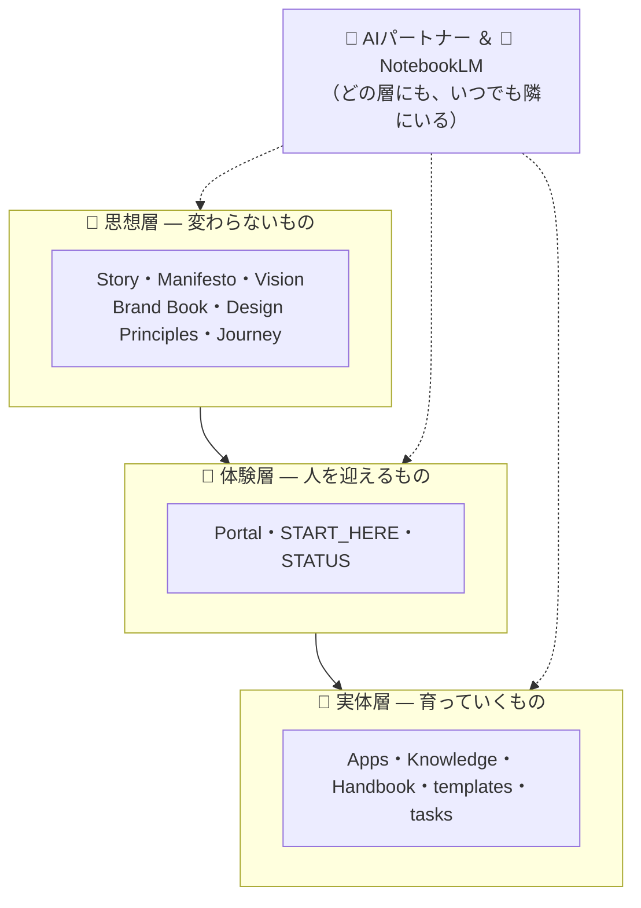

# 📖 Workspace Handbook — 表紙と目次

> 🧭 ここはNESTの**説明書（Handbook）の表紙**です。使い方とルールの正式版がここから引けます。

## 第0章 この説明書の読み方

**全部読まなくて大丈夫です。** 必要になった章だけ、必要になったときに読んでください。はじめての方はこの目次より先に [START_HERE](../START_HERE.md) がおすすめです。

## 第1章 NESTの全体像

NESTは3階建て＋2人の同伴者でできています。

詳しくは [思想層の目次](philosophy/README.md) へ。

## 章立て

| 章 | 内容 | 本文 |
|---|---|---|
| 第2章 ものづくりの流れ | アプリ作成→仕様→タスク→実装→リリース（はじめてモード含む） | [development-flow.md](development-flow.md) |
| 第3章 Gitとの付き合い方 | ブランチ・コミット・マージの約束 | [git-workflow.md](git-workflow.md) |
| 第4章 書き方のルール | コーディング規約 | [coding-standards.md](coding-standards.md) |
| 第5章 テストと動作確認 | 何をどこまで確認するか | [testing-policy.md](testing-policy.md) |
| 第6章 レビューのしかた | セルフレビューとAIクロスレビュー | [review-process.md](review-process.md) |
| 第7章 AIと働く | AIツールの案内・使い分け | [ai-tools.md](ai-tools.md)＋[AGENTS.md](../AGENTS.md) |
| 第8章 記録の残し方 | どの情報をどこに書くか | [AGENTS.md §3](../AGENTS.md)＋[knowledge/](../knowledge/README.md)＋[adr/](adr/) |

## 付録

| 付録 | 内容 |
|---|---|
| [用語集](glossary.md) | やさしい言葉の辞書 |
| [人間にしかできない操作リスト](human-only-operations.md) | AIに任せられない操作の一覧と手順 |
| [共通語彙台帳](vocabulary.md) | 場所の呼び名・絵文字の台帳 |
| [Starter Kit — NESTのDNA](starter-kit.md) | 新しい巣を生む最小単位の定義 |
| [フェーズレビューの記録](reviews/README.md) | 設計思想が育った歴史 |
| [設計判断の記録（ADR）](adr/) | 個別判断の理由 |

---

📍 **戻る**: [README（全体像）](../README.md)　|　**はじめての方**: [START_HERE](../START_HERE.md)
